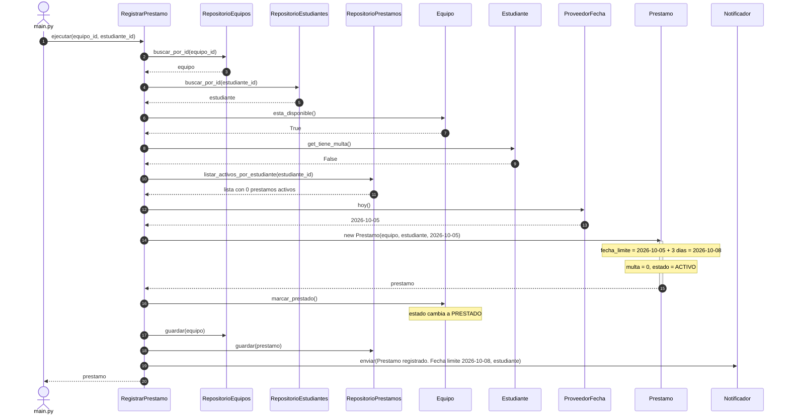
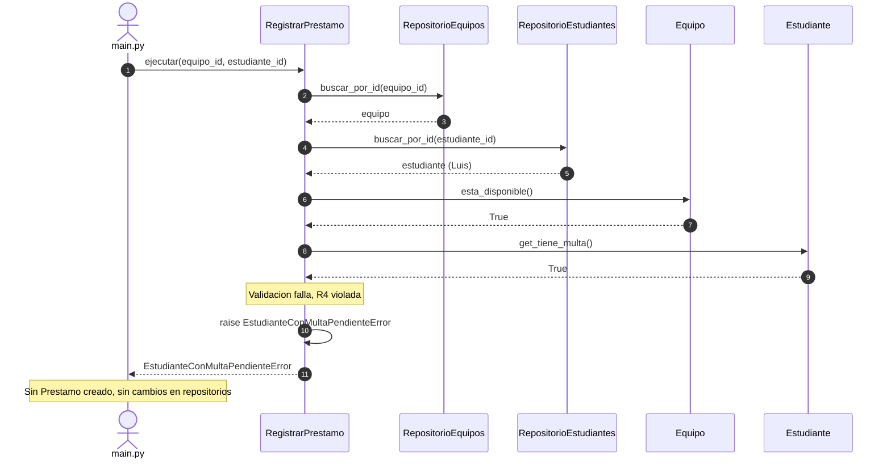
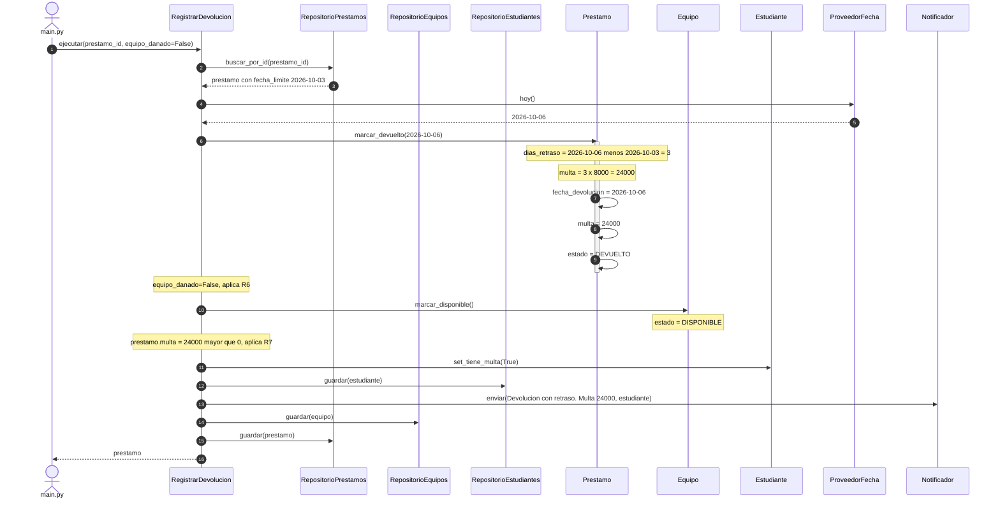
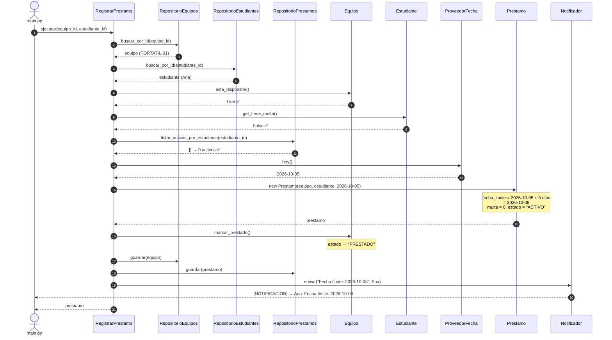
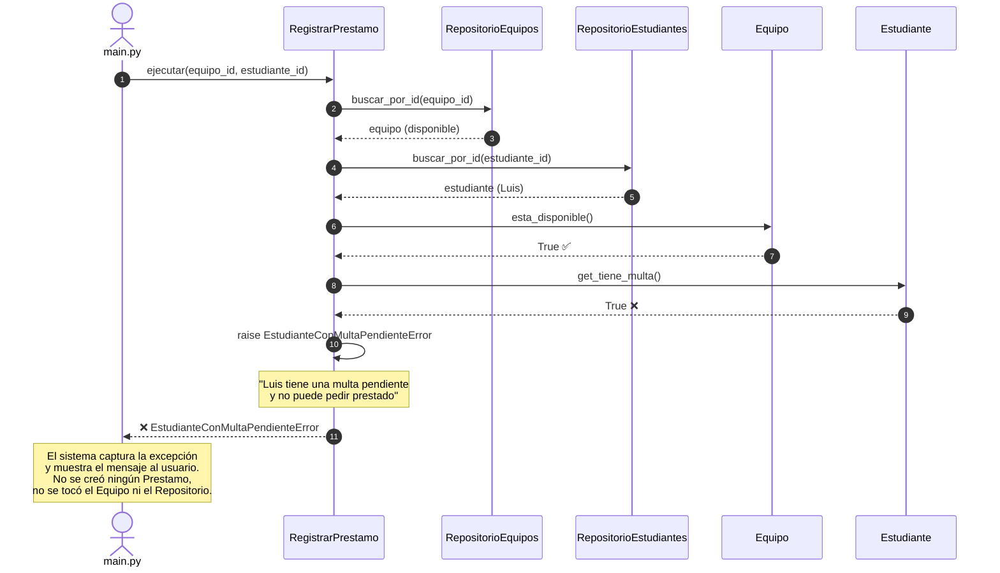
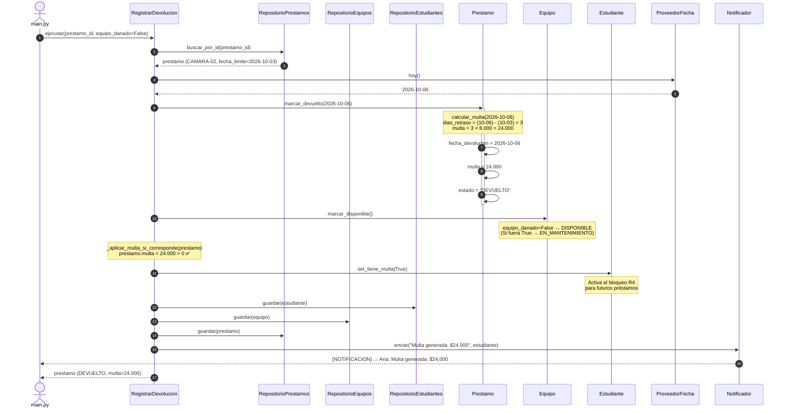

# Diagramas de Secuencia — Sistema de Préstamo de Equipos

## Diagrama 1: Préstamo Exitoso (CA1 — R1, R2, R4)

---

## Diagrama 2: Préstamo Rechazado por Multa Pendiente (CA4 — R4)

---

## Diagrama 3: Devolución Tardía con Multa (CA3 — R5, R6, R7)

## Diagrama 1: Préstamo Exitoso (CA1)
> Ana no tiene préstamos y pide PORTATIL-01. Se crea el préstamo con fecha límite y se notifica.

---

## Diagrama 2: Préstamo Rechazado por Multa Pendiente (CA4 — R4)
> Luis tiene una multa pendiente. El sistema rechaza el préstamo antes de crear cualquier objeto.

> **Variaciones del rechazo** — el mismo flujo aplica para:
> - **R1 (CA2):** `listar_activos_por_estudiante()` retorna 2 → `LimitePrestamosExcedidoError`
> - **R2 (CA5):** `esta_disponible()` retorna `False` → `EquipoNoDisponibleError`

---

## Diagrama 3: Devolución Tardía con Multa (CA3 — R5, R6, R7)
> CAMARA-02 fue prestada el 2026-10-01 (límite 2026-10-03) y se devuelve el 2026-10-06.
> Retraso: 3 días. Multa: 3 × $8.000 = $24.000.

